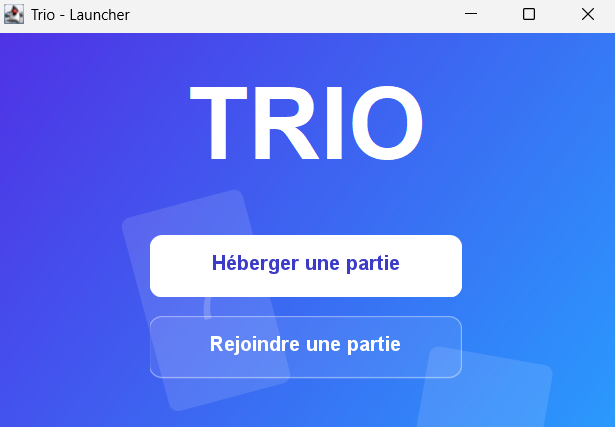
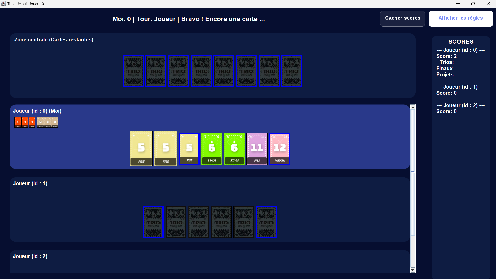
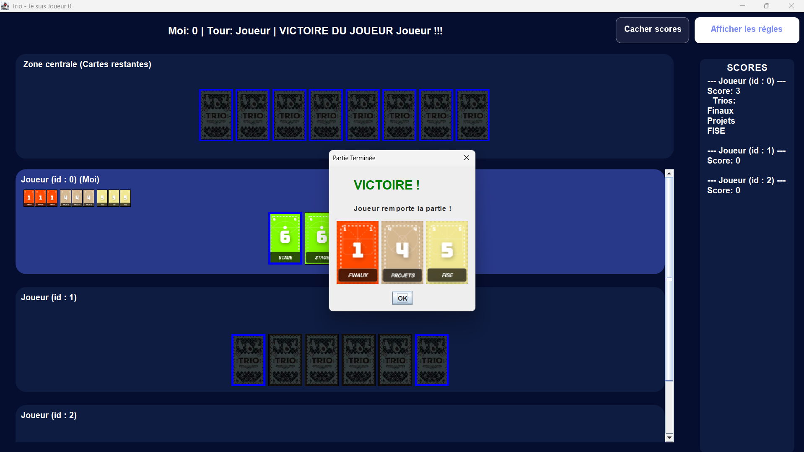

# Trio: Memory & Deduction Game

## Overview
**Trio** is a memory-based card game implemented as a distributed Java application. Developed as a group academic project, this version features a custom themed card set and a client/server architecture that allows for 3 to 6 players to compete over a local network.

### The Game
The objective is to form "trios" (groups of three identical cards). The game ends when a player successfully forms 3 trios or collects the special "7" trio. Players use memory and deduction, with the ability to reveal cards from the center or challenge other players to reveal their highest or lowest value cards.

## Features
*   **Multiplayer Architecture:** Uses Java Sockets to support real-time network play (Client/Server).
*   **UTBM Themed:** Custom card set reflecting the university environment (e.g., "Finals," "Diplôme," "Stage").
*   **Responsive GUI:** Built with **Java Swing**, providing a clean interface that updates dynamically based on game state changes.
*   **Threaded Networking:** Efficiently handles multiple concurrent players using dedicated threads on the server.

## Architecture
The project is strictly organized into three core modules:
1.  **Model:** Manages the game logic, card distribution, and scoring rules.
2.  **GUI:** Handles user interaction and visual rendering using the Swing library.
3.  **Network:** Manages client-server communication, ensuring synchronized game states across all players' screens.

## Technical Details
*   **Language:** Java
*   **Library:** Swing (GUI), Sockets/Threads (Network)
*   **Design Pattern:** Client-Server / MVC-inspired architecture

## How to Play
1.  **Host:** Launch the server and click "Héberger" (Host). Share your IP address with other players.
2.  **Join:** Other players click "Rejoindre" (Join) and enter the host's IP address.
3.  **Gameplay:** The host starts the game once the required number of players (3-6) have connected. Use the interface to reveal cards and form your winning trios.

